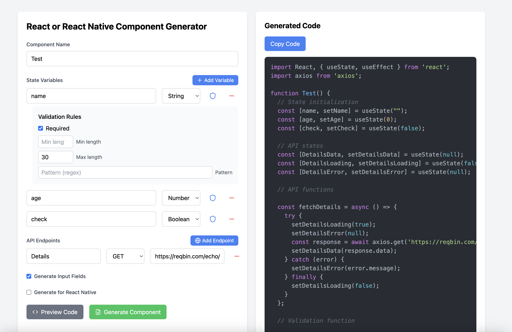

# React & React Native Component Generator

A simple web application that allows users to generate React and React Native components based on user-defined state variables and API endpoints. This tool helps streamline the development process by automating the boilerplate code generation for components.

## Features

- **Component Name Input**: Specify the name of the component to be generated.
- **State Variables**: Add, edit, and remove state variables with validation rules.
- **API Endpoints**: Define API endpoints with methods (GET, POST, PUT, DELETE) and URLs.
- **Input Fields**: Optionally generate input fields for the defined state variables.
- **Validation Rules**: Set validation rules for state variables (required, min/max length, min/max value, regex pattern).
- **Code Preview**: Preview the generated code in real-time.
- **Copy to Clipboard**: Easily copy the generated code to your clipboard.

## Technologies Used

- **React**: A JavaScript library for building user interfaces.
- **React Native**: A framework for building native apps using React.
- **Axios**: A promise-based HTTP client for making API requests.
- **React Syntax Highlighter**: A library for syntax highlighting in code previews.
- **Lucide React**: A collection of icons for React applications.

## Installation

1. Clone the repository:

   ```bash
   git clone https://github.com/babarbilal56/react-component-generator.git
   cd react-component-generator
   ```

2. Install the dependencies:

   ```bash
   npm install
   ```

3. Start the development server:

   ```bash
   npm run dev
   ```

4. Open your browser and navigate to `http://localhost:3000` to view the application.

## Usage

1. Enter the desired component name in the input field.
2. Add state variables by clicking the "Add Variable" button. Specify the variable name and type (string, number, boolean).
3. Optionally, set validation rules for each state variable.
4. Add API endpoints by clicking the "Add Endpoint" button. Specify the endpoint name, method, and URL.
5. Toggle the "Generate Input Fields" option to include input fields for the state variables in the generated component.
6. Toggle the "Generate for React Native" option to generate a React Native component instead of a React component.
7. Click the "Generate Component" button to generate the code.
8. Preview the generated code and copy it to your clipboard if needed.

## Contributing

Contributions are welcome! If you have suggestions for improvements or new features, feel free to open an issue or submit a pull request.

## License

This project is licensed under the MIT License. See the [LICENSE](LICENSE) file for details.

## Acknowledgments

- Thanks to the open-source community for providing the libraries and tools that make this project possible.
